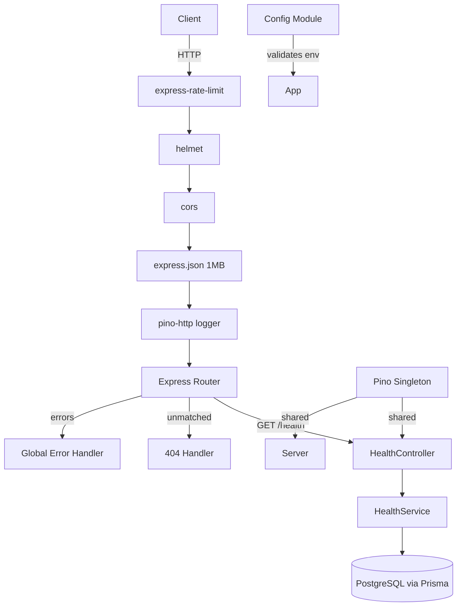
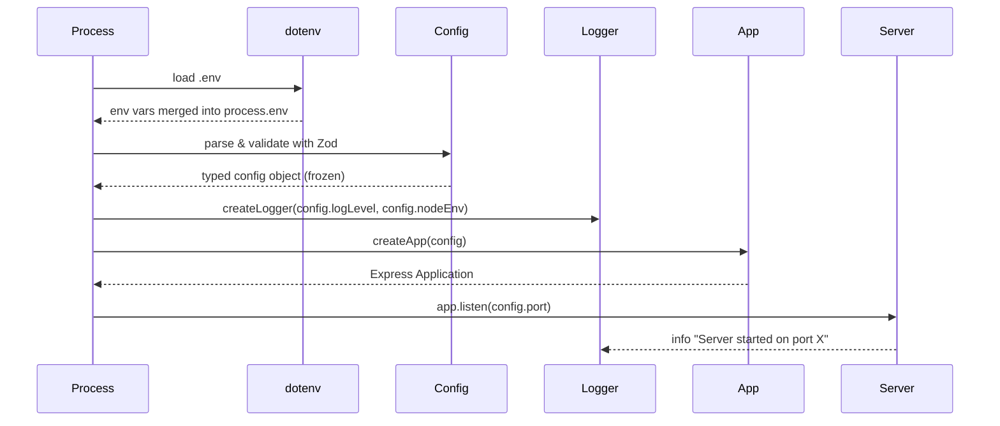
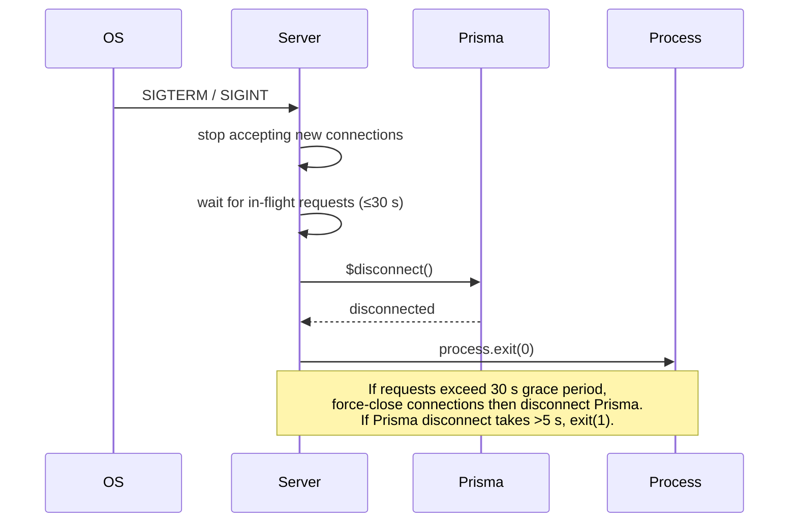

# Design Document — Tamper-Evident Log Service

## Overview

The Tamper-Evident Append-Only Log Service is a production-ready Node.js/Express/TypeScript backend that stores cryptographically-linked audit entries in PostgreSQL via Prisma ORM. Each log record embeds the SHA-256 hash of its predecessor, forming an immutable hash chain: any retroactive modification of a past entry breaks the chain and is immediately detectable during a verification sweep.

This design document covers the **foundational infrastructure phase**:

- Project layout and toolchain configuration
- Environment configuration with startup validation
- Prisma schema and migration strategy
- Express application factory and server bootstrap
- Structured logging (Pino)
- Health endpoint
- Rate limiting

Business-logic layers (hash generation, chain verification, authentication, CRUD API) are deferred to subsequent phases.

### Key Design Goals

| Goal | Mechanism |
|---|---|
| Fail-fast configuration | Zod validation at process start |
| Testability | App factory pattern (app ≠ server) |
| Tamper-evidence | SHA-256 hash chain stored in DB |
| Observability | Pino JSON logs + `/health` endpoint |
| Abuse resistance | Global fixed-window rate limiting |
| Graceful shutdown | 30 s drain, Prisma disconnect, clean exit |

---

## Architecture

### Component Diagram



### Startup Sequence



### Graceful Shutdown Sequence



### Layer Responsibility Map

| Layer | Directory | Responsibility |
|---|---|---|
| Config | `src/config/` | Env var loading & typed validation |
| Routes | `src/routes/` | URL-to-controller mapping |
| Controllers | `src/controllers/` | HTTP request/response handling |
| Services | `src/services/` | Business logic orchestration |
| Repositories | `src/repositories/` | Prisma data-access abstraction |
| Middlewares | `src/middlewares/` | Cross-cutting HTTP concerns |
| Validators | `src/validators/` | Zod request-body schemas |
| Utils | `src/utils/` | Pure helper functions |
| Interfaces | `src/interfaces/` | TypeScript interface declarations |
| Types | `src/types/` | Shared TypeScript type aliases |
| Constants | `src/constants/` | Application-wide constants |
| Errors | `src/errors/` | Custom error classes |
| Lib | `src/lib/` | Third-party client singletons (Prisma, Pino) |

---

## Components and Interfaces

### `src/config/index.ts` — Config Module

Responsibilities:
1. Call `dotenv.config()` before any other module reads `process.env`.
2. Define a Zod schema that validates required and optional variables.
3. Export a `const`-frozen, typed `config` object.

```typescript
// Public interface
export interface AppConfig {
  readonly port: number;
  readonly nodeEnv: 'development' | 'test' | 'production';
  readonly databaseUrl: string;
  readonly logLevel: 'trace' | 'debug' | 'info' | 'warn' | 'error' | 'fatal';
  readonly rateLimitMax: number;
  readonly rateLimitWindowMs: number;
}

export const config: Readonly<AppConfig>;
```

Validation rules (enforced by Zod):

| Variable | Type | Constraint |
|---|---|---|
| `PORT` | integer | 1–65535 |
| `NODE_ENV` | enum | `development`, `test`, `production` |
| `DATABASE_URL` | string | non-empty |
| `LOG_LEVEL` | enum | `trace`, `debug`, `info`, `warn`, `error`, `fatal`; default `info` |
| `RATE_LIMIT_MAX` | integer | positive; default `100` |
| `RATE_LIMIT_WINDOW_MS` | integer | positive; default `60000` |

On validation failure: log a human-readable error identifying the failed field(s), then `process.exit(1)`.

### `src/lib/logger.ts` — Logger Singleton

```typescript
import pino from 'pino';

export function createLogger(level: string, nodeEnv: string): pino.Logger;
export const logger: pino.Logger; // singleton initialised with config
```

- `NODE_ENV === 'production'` → `{ transport: undefined }` (raw JSON to stdout)
- `NODE_ENV === 'development'` → `{ transport: { target: 'pino-pretty' } }`
- Any other value → JSON format (same as production)
- Redacted paths: `['req.headers.authorization', 'req.body.password', 'req.body.token', 'req.body.secret', '*.token', '*.secret', '*.password', '*.authorization']`

### `src/lib/prisma.ts` — Prisma Client Singleton

```typescript
import { PrismaClient } from '@prisma/client';
export const prisma: PrismaClient;
```

Single shared instance to avoid connection pool exhaustion. Exported for use in repositories and the health service.

### `src/app.ts` — App Factory

```typescript
import { Application } from 'express';
import { AppConfig } from './config';

export function createApp(config: AppConfig): Application;
```

Middleware registration order (strict):
1. `helmet()` — security headers
2. `cors()` — cross-origin policy
3. `express.json({ limit: '1mb' })` — body parsing
4. `pinoHttp({ logger })` — HTTP request logging
5. `rateLimit({ max, windowMs, ... })` — rate limiting
6. Route mounts (`/health`)
7. 404 handler
8. Global error handler (5-parameter error middleware)

### `src/server.ts` — Entry Point

```typescript
async function main(): Promise<void>;
```

- Calls `createApp(config)`
- Calls `app.listen(config.port)`
- Logs startup info
- Registers `SIGTERM`/`SIGINT` signal handlers for graceful shutdown

### `src/controllers/health.controller.ts`

```typescript
export async function healthCheck(
  req: Request,
  res: Response,
  next: NextFunction
): Promise<void>;
```

Delegates to `HealthService.check()`, maps result to HTTP 200 or 503.

### `src/services/health.service.ts`

```typescript
export interface HealthStatus {
  status: 'ok' | 'degraded';
  database: 'ok' | 'unreachable';
  timestamp: string; // ISO-8601 UTC
}

export async function checkHealth(): Promise<HealthStatus>;
```

Runs `prisma.$queryRaw\`SELECT 1\`` inside a 1000 ms `Promise.race` timeout. Returns `HealthStatus` regardless of outcome (no thrown exceptions to the controller layer).

### `src/routes/health.routes.ts`

```typescript
import { Router } from 'express';
export const healthRouter: Router;
// GET /health → healthCheck controller
```

### `src/middlewares/error.middleware.ts`

```typescript
export function notFoundHandler(req: Request, res: Response): void;
export function globalErrorHandler(
  err: Error,
  req: Request,
  res: Response,
  next: NextFunction
): void;
```

- `notFoundHandler` → 404 `{ "error": "Not Found" }`
- `globalErrorHandler` → 500 `{ "error": "Internal Server Error" }` (no stack trace in response)

---

## Data Models

### Prisma Schema (`prisma/schema.prisma`)

```prisma
generator client {
  provider = "prisma-client-js"
}

datasource db {
  provider = "postgresql"
  url      = env("DATABASE_URL")
}

model LogEntry {
  id           String   @id @default(uuid())
  actor        String   @db.VarChar(255)
  action       String   @db.VarChar(500)
  payload      Json?
  previousHash String?
  currentHash  String   @unique @db.VarChar(128)
  createdAt    DateTime @default(now()) @db.Timestamptz(6)

  @@index([createdAt])
}
```

**Field rationale:**

| Field | Design Decision |
|---|---|
| `id` | UUID v4 auto-generated — avoids sequential ID enumeration |
| `actor` | VarChar(255) matches common username/service-name length limits |
| `action` | VarChar(500) — short event descriptor, not a free-text blob |
| `payload` | Nullable JSON — flexible metadata without schema coupling |
| `previousHash` | Nullable — genesis entry has no predecessor; links the chain |
| `currentHash` | Unique VarChar(128) — accommodates SHA-256 hex (64 chars) with headroom for future algorithms |
| `createdAt` | Timestamptz with `@default(now())` — immutable insertion time; no `@updatedAt` |
| `@@index([createdAt])` | Supports efficient ascending chain traversal and range queries |

### TypeScript Types (`src/types/log-entry.types.ts`)

```typescript
export interface LogEntryRecord {
  id: string;
  actor: string;
  action: string;
  payload: Record<string, unknown> | null;
  previousHash: string | null;
  currentHash: string;
  createdAt: Date;
}
```

### Configuration Types (`src/types/config.types.ts`)

```typescript
export type NodeEnv = 'development' | 'test' | 'production';
export type LogLevel = 'trace' | 'debug' | 'info' | 'warn' | 'error' | 'fatal';
```

### Health Response Types (`src/types/health.types.ts`)

```typescript
export interface HealthResponse {
  status: 'ok' | 'degraded';
  database: 'ok' | 'unreachable';
  timestamp: string;
}
```

---

## Correctness Properties

*A property is a characteristic or behavior that should hold true across all valid executions of a system — essentially, a formal statement about what the system should do. Properties serve as the bridge between human-readable specifications and machine-verifiable correctness guarantees.*

### Property 1: Config validation rejects invalid environment variables

*For any* set of environment variables where one or more required fields (`PORT`, `NODE_ENV`, `DATABASE_URL`, `LOG_LEVEL`) are absent or have invalid values, the config module SHALL refuse to produce a valid config object, and the process SHALL terminate with exit code `1`.

**Validates: Requirements 4.3, 4.4, 4.5, 11.4**

---

### Property 2: Config validation accepts all valid environment combinations

*For any* well-formed combination of environment variables (valid `PORT` in 1–65535, `NODE_ENV` in the allowed enum, non-empty `DATABASE_URL`, valid `LOG_LEVEL`), the config module SHALL produce a frozen, typed config object without throwing or exiting.

**Validates: Requirements 4.2, 4.6**

---

### Property 3: Rate-limit defaults are applied when variables are absent

*For any* application instance started without `RATE_LIMIT_MAX` or `RATE_LIMIT_WINDOW_MS` in the environment, the rate limiter SHALL be configured with exactly 100 requests per 60,000 milliseconds.

**Validates: Requirements 11.3**

---

### Property 4: Rate-limit enforcement

*For any* IP address that submits more than `RATE_LIMIT_MAX` requests within a single `RATE_LIMIT_WINDOW_MS` window, every request beyond the limit SHALL receive HTTP 429 with body `{ "error": "Too Many Requests" }`, and no request at or below the limit SHALL be rejected with 429.

**Validates: Requirements 11.1, 11.2**

---

### Property 5: Health endpoint reflects database reachability

*For any* request to `GET /health`, the `database` field in the response body SHALL be `"ok"` if and only if the Prisma connectivity check completed successfully within 1000 milliseconds, and SHALL be `"unreachable"` otherwise; the HTTP status SHALL be `200` when `"ok"` and `503` when `"unreachable"`.

**Validates: Requirements 10.1, 10.2, 10.3, 10.4**

---

### Property 6: Health response timestamp is a valid ISO-8601 UTC string

*For any* `GET /health` response, the `timestamp` field SHALL be a valid ISO-8601 UTC datetime string (parseable by `new Date()`) and SHALL represent a time no earlier than the moment the request was received.

**Validates: Requirements 10.1, 10.3**

---

### Property 7: 404 handler fires for every unregistered route

*For any* HTTP method and path combination that does not match a registered route, the server SHALL respond with HTTP 404 and JSON body `{ "error": "Not Found" }`.

**Validates: Requirements 7.4**

---

### Property 8: Global error handler never leaks stack traces

*For any* unhandled error that reaches the global error handler, the response body SHALL not contain a `stack` field, and the HTTP status SHALL be exactly `500` with body `{ "error": "Internal Server Error" }`.

**Validates: Requirements 7.5**

---

### Property 9: Logger redacts sensitive fields

*For any* HTTP request whose headers or body contain fields named `authorization`, `password`, `token`, or `secret`, the log entry emitted by pino-http SHALL not contain the raw value of those fields.

**Validates: Requirements 9.6**

---

### Property 10: Logger format follows NODE_ENV

*For any* logger instance, when `NODE_ENV` is `production` or any non-`development` value, log entries SHALL be valid JSON objects; when `NODE_ENV` is `development`, log entries SHALL be human-readable (pretty-printed) and not raw JSON lines.

**Validates: Requirements 9.2, 9.3, 9.4**

---

## Error Handling

### Error Taxonomy

| Scenario | HTTP Status | Response Body | Log Level |
|---|---|---|---|
| Unregistered route | 404 | `{ "error": "Not Found" }` | — (pino-http logs the request) |
| Unhandled exception | 500 | `{ "error": "Internal Server Error" }` | `error` |
| Rate limit exceeded | 429 | `{ "error": "Too Many Requests" }` | — |
| DB unreachable (health) | 503 | `{ "status": "degraded", "database": "unreachable", "timestamp": "..." }` | `warn` |
| Config validation failure | — (process exit) | stderr human-readable message | `error` (before logger init) |
| Port already in use | — (process exit 1) | — | `error` |

### Principles

1. **No stack traces in responses** — the global error handler logs the full error internally but sends only a generic message to the client.
2. **Fail-fast on misconfiguration** — bad env vars cause `process.exit(1)` before the HTTP server starts, preventing silent misconfiguration in production.
3. **Structured errors** — custom error classes in `src/errors/` will carry HTTP status codes and machine-readable codes for future use.
4. **Health degraded, not errored** — DB unreachability at the health endpoint is a `503 Degraded` response, not a 500, because it is a known, expected failure mode.
5. **Graceful shutdown never drops in-flight work** — the 30-second drain window protects requests already being processed when a termination signal arrives.

### Custom Error Base (`src/errors/AppError.ts`)

```typescript
export class AppError extends Error {
  constructor(
    public readonly message: string,
    public readonly statusCode: number,
    public readonly code: string,
    public readonly isOperational: boolean = true
  ) {
    super(message);
    Object.setPrototypeOf(this, new.target.prototype);
  }
}
```

The `isOperational` flag distinguishes expected domain errors from programmer errors, guiding the global error handler's logging severity.

---

## Testing Strategy

### Framework and Toolchain

| Concern | Tool |
|---|---|
| Test runner | Jest (`ts-jest` preset) |
| HTTP integration | Supertest |
| Property-based tests | fast-check |
| Mocking | Jest `jest.mock()` + manual stubs |

### Unit Tests

Focus areas (example-based):

- **Config module**: valid and invalid env combinations, default values for optional vars, frozen object assertion.
- **Logger factory**: correct format selected per `NODE_ENV`, correct `LOG_LEVEL` applied.
- **Health service**: DB reachable path, DB unreachable path, timeout path (mock `prisma.$queryRaw` to delay > 1000 ms).
- **Middleware — notFoundHandler**: any path returns 404 + correct body.
- **Middleware — globalErrorHandler**: error with and without `statusCode`, never exposes `.stack`.
- **App factory**: middleware registration order verifiable via Supertest against in-memory app.

### Integration Tests (`tests/integration/`)

- `GET /health` with real Prisma mocked via `jest.mock('../src/lib/prisma')`:
  - DB reachable → 200 `{ status: "ok", ... }`
  - DB unreachable → 503 `{ status: "degraded", ... }`
  - DB timeout → 503
- Rate limit: send `RATE_LIMIT_MAX + 1` requests in one window, assert the last is 429.
- 404 catch-all: request unknown path, assert 404 + body.
- Error handler: mount a test route that throws, assert 500 + body.

### Property-Based Tests (`tests/property/`)

Property-based testing is applicable because the config parsing and middleware response logic are pure or near-pure functions with well-defined input spaces. We use **fast-check** (minimum **100 iterations** per test).

Each property test references its design document property with the tag comment:  
`// Feature: tamper-evident-log-service, Property N: <property text>`

#### Property 1 — Config rejects invalid env (Req 4.3, 4.4, 4.5, 11.4)

Generate random env objects with one or more required fields set to invalid values (e.g., `PORT` as a non-integer string, `NODE_ENV` as an arbitrary string outside the enum). Assert that Zod parsing throws / returns an error rather than producing a config object.

#### Property 2 — Config accepts valid env (Req 4.2, 4.6)

Generate env objects with all required fields within valid ranges (port 1–65535, valid NODE_ENV enum values, etc.). Assert that parsing succeeds and the returned config is frozen (`Object.isFrozen`).

#### Property 3 — Rate-limit defaults (Req 11.3)

For any app instance without `RATE_LIMIT_MAX` / `RATE_LIMIT_WINDOW_MS`, assert the middleware is configured with `max = 100` and `windowMs = 60000`.

#### Property 4 — Rate-limit enforcement (Req 11.1, 11.2)

Generate a random `maxRequests` value (1–20 for test speed). Send exactly `maxRequests` requests and assert all are non-429. Send one more and assert 429.

#### Property 5 — Health DB reachability (Req 10.1–10.4)

For any mock that either resolves or rejects the `$queryRaw` call, the health controller response SHALL satisfy: `database === 'ok' ↔ status === 200` and `database === 'unreachable' ↔ status === 503`.

#### Property 6 — Health timestamp validity (Req 10.1, 10.3)

For any `GET /health` response, `new Date(body.timestamp)` SHALL be a valid non-NaN Date, and the timestamp SHALL be within a 5-second window of `Date.now()` at the time of the request.

#### Property 7 — 404 on unregistered routes (Req 7.4)

Generate random HTTP method and path strings not in the registered route table. Assert every response is 404 with `{ "error": "Not Found" }`.

#### Property 8 — Error handler no stack leak (Req 7.5)

For any Error instance (with or without a stack), the global error handler SHALL return 500 with a body that JSON-stringifies cleanly and contains no `stack` key.

#### Property 9 — Logger redacts sensitive fields (Req 9.6)

Generate log records containing fields named `authorization`, `password`, `token`, or `secret` with arbitrary string values. Assert the serialised log output does not contain the original raw value of any of those fields.

#### Property 10 — Logger format by NODE_ENV (Req 9.2–9.4)

For `NODE_ENV = 'production'` or any value outside `{'development'}`, assert the logger's output stream contains valid JSON. For `NODE_ENV = 'development'`, assert the output is not raw JSON (pretty-print format).

### Test Configuration

```json
// jest.config.ts
{
  "preset": "ts-jest",
  "testEnvironment": "node",
  "roots": ["<rootDir>/tests"],
  "collectCoverageFrom": ["src/**/*.ts"],
  "coverageThreshold": {
    "global": { "lines": 80, "functions": 80 }
  }
}
```

Property tests run with `fc.assert(fc.property(...), { numRuns: 100 })` minimum.
